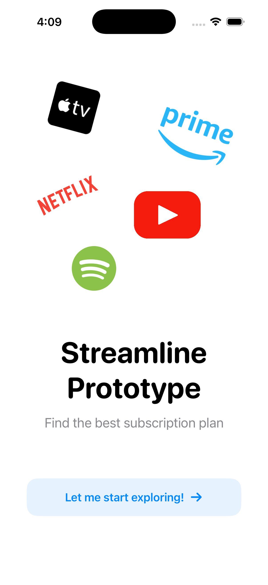
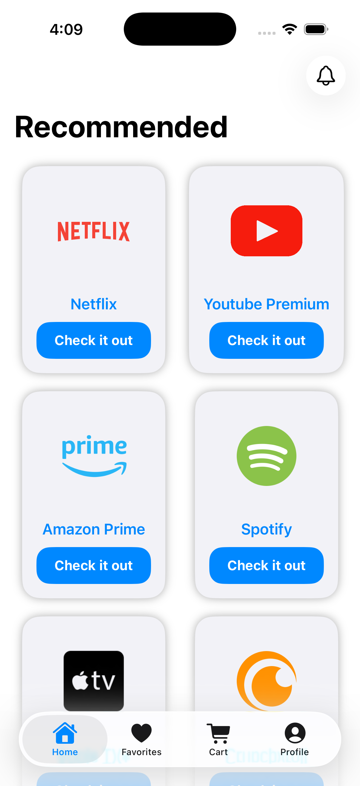
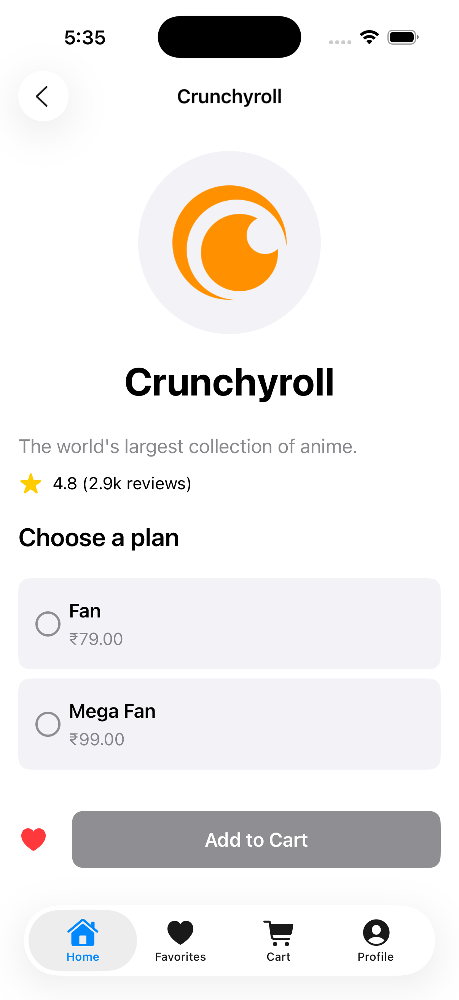
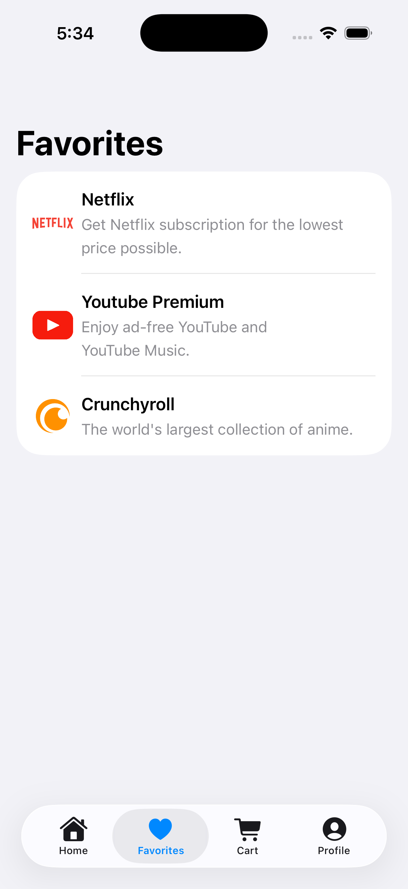
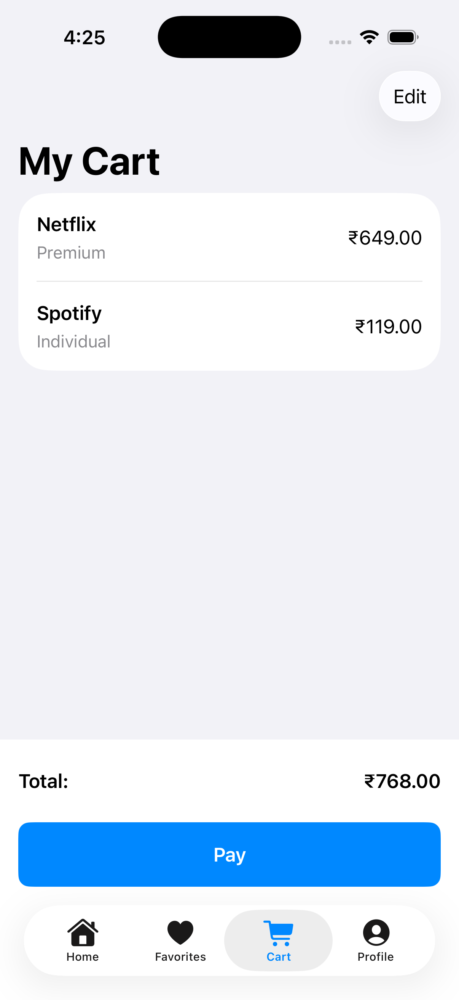
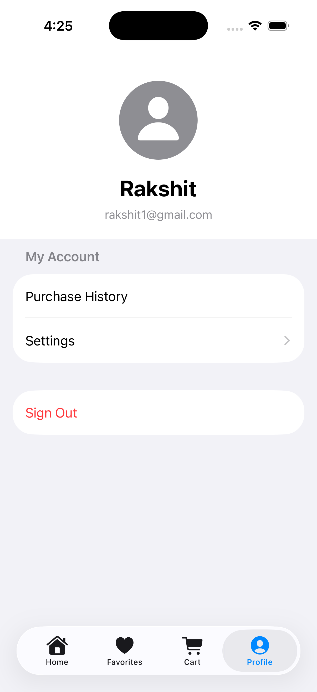

# Streamline (iOS native build)

Streamline is a mobile application designed to simplify the management and discovery of subscription services. In an era where digital subscriptions are ubiquitous, Streamline offers a centralized platform for users to find new services, manage their favorites, track their cart, and customize their app experience. This project serves as a prototype demonstrating key functionalities of such a platform, built using SwiftUI and integrated with Firebase for backend services.


<p align="center">
  
</p>

## Table of Contents

- [Features](#features)
- [Screenshots](#screenshots)
- [Technologies Used](#technologies-used)
- [Getting Started](#getting-started)
  - [Prerequisites](#prerequisites)
  - [Installation](#installation)
  - [Firebase Setup](#firebase-setup)
- [Contributing](#contributing)
- [License](#license)

## Features

Streamline offers a suite of functionalities aimed at enhancing the subscription management experience:

-   **User Authentication:** Secure user registration and login powered by Firebase Authentication.
-   **Subscription Discovery:** Browse a curated list of popular streaming and digital subscription services.
-   **Detailed Information:** View comprehensive details for each subscription, including descriptions, ratings, review counts, and available plans.
-   **Plan Selection:** Select specific plans within a subscription before adding to the cart.
-   **Favorites Management:** Mark subscriptions as favorites for quick access and personalized tracking, with data stored in Firestore.
-   **Shopping Cart:** Add desired subscription plans to a shopping cart, with real-time syncing to Firestore.
-   **Cart Item Management:** Easily view, update, and remove items from the shopping cart.
-   **Total Price Calculation:** Automatic calculation of the total cost for all items in the cart.
-   **Theme Customization:** Users can select their preferred app theme (Light, Dark, or System default) via settings, with preferences persisted across app launches.
-   **Placeholder Payment Option:** A "Proceed to Pay" button in the cart provides a visual element for a future payment integration (currently non-functional for prototype purposes).

## Screenshots

<p align="center">
  
</p>


<p align="center">
  
  
  
  
  
  
</p>

## Technologies Used

-   **SwiftUI:** For building the declarative and modern user interface.
-   **Firebase:**
    -   **Firebase Authentication:** For user registration and login.
    -   **Firestore:** A NoSQL cloud database for real-time data storage, including user favorites and cart items.
-   **Combine:** For reactive programming and managing asynchronous data flows within the app.
-   **Swift Package Manager (SPM):** For dependency management.

## Getting Started

Follow these instructions to get a copy of the project up and running on your local machine for development and testing purposes.

### Prerequisites

-   Xcode 15.0+
-   iOS 15.0+
-   A macOS machine

### Installation

1.  **Clone the repository:**
    ```bash
    git clone [https://github.com/YourUsername/Streamline.git](https://github.com/YourUsername/Streamline.git)
    cd Streamline
    ```
2.  **Open in Xcode:**
    Open the `Streamline.xcodeproj` file in Xcode.
3.  **Resolve Dependencies:**
    Xcode should automatically resolve Swift Package Manager dependencies. If not, go to `File > Packages > Resolve Package Versions`.

### Firebase Setup

Streamline uses Firebase for authentication and database services. You will need to set up your own Firebase project:

1.  **Create a Firebase Project:**
    Go to the [Firebase Console](https://console.firebase.google.com/) and create a new project.
2.  **Add an iOS App:**
    Follow the instructions to add an iOS app to your Firebase project.
3.  **Download `GoogleService-Info.plist`:**
    Download the `GoogleService-Info.plist` file.
4.  **Add to Xcode:**
    Drag and drop the `GoogleService-Info.plist` file into your Xcode project's root folder (usually `Streamline/Streamline`). Make sure "Copy items if needed" is checked and it's added to your `Streamline` target.
5.  **Enable Services:**
    -   **Authentication:** In the Firebase Console, navigate to "Authentication" and enable the "Email/Password" sign-in method.
    -   **Firestore Database:** In the Firebase Console, navigate to "Firestore Database" and create a new database. Choose "Start in production mode" and set up your security rules appropriately (for a prototype, you might temporarily allow read/write access for testing, but ensure this is secured for any production release).
        Example Firestore Rules for testing:
        ```
        rules_version = '2';
        service cloud.firestore {
          match /databases/{database}/documents {
            match /users/{userId} {
              allow read, write: if request.auth.uid == userId;
              match /favorites/{favoriteId} {
                allow read, write: if request.auth.uid == userId;
              }
              match /cart/{cartId} {
                allow read, write: if request.auth.uid == userId;
              }
            }
          }
        }
        ```

## Contributing

Contributions are welcome! If you have suggestions or want to improve the project, please open an issue or submit a pull request :).

## License

This project is open-source and available under the MIT License. See the `LICENSE` file for more details.


## Author
Rakshit Kumar
